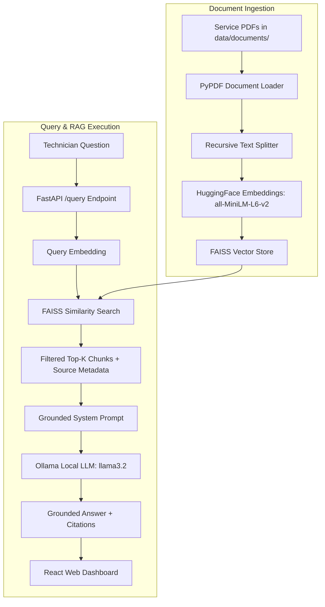

# BMW Service Knowledge RAG Assistant

An AI-powered Retrieval-Augmented Generation (RAG) assistant designed for BMW service technicians. 

This application ingests BMW technical service manuals, builds a local vector index using Hugging Face embeddings and FAISS, and uses a local Ollama LLM (`llama3.2`) to deliver strictly grounded technical answers complete with document and page citations.

---

## 1. Project Overview

BMW service technicians frequently navigate complex repair procedures, electrical troubleshooting guides, and EV high-voltage safety requirements. Traditional keyword search can miss semantic context, while standard cloud LLMs risk hallucinating torque values, wiring diagrams, or hazardous high-voltage procedures.

**The Solution:**
This system implements a strict Retrieval-Augmented Generation (RAG) architecture:
1. **Mandatory Retrieval**: Every query first performs vector similarity search over ingested BMW PDFs.
2. **Grounded Answer Generation**: The retrieved text chunks are injected into a strict system prompt targeting a local **Ollama** LLM (`llama3.2`).
3. **No-Hallucination Policy**: If the retrieved documents do not contain sufficient technical information, the assistant explicitly reports that information is unavailable rather than inventing steps.
4. **Source Citations**: Every answer highlights the exact PDF file name and 1-indexed page numbers.

---

## 2. Core Architecture



---

## 3. Technology Stack

- **Backend**: Python 3.10+, FastAPI, Uvicorn, LangChain, Pydantic v2
- **Vector Database**: FAISS (`faiss-cpu`)
- **Embeddings**: Hugging Face `sentence-transformers/all-MiniLM-L6-v2` (Free, 100% Local)
- **Local LLM**: Ollama (`llama3.2`)
- **Document Ingestion**: PyPDF (`pypdf`), ReportLab (for sample PDF generation)
- **Frontend**: React 18, Vite, Axios, Plain CSS (Custom BMW Technician Theme)

---

## 4. Installation Guide

### Prerequisites
1. **Python 3.10+**
2. **Node.js 18+** & `npm`
3. **Ollama** installed locally ([ollama.com](https://ollama.com/))

### Step 1: Install & Pull Ollama Model
Start Ollama and pull the lightweight `llama3.2` model:
```bash
ollama pull llama3.2
```

### Step 2: Set Up Backend Environment
Navigate to the `backend` directory, create a virtual environment, and install dependencies:
```bash
cd backend
python -m venv venv
# Windows:
venv\Scripts\activate
# Linux/macOS:
source venv/bin/activate

pip install -r requirements.txt
```

### Step 3: Set Up Frontend Environment
Navigate to the `frontend` directory and install dependencies:
```bash
cd ../frontend
npm install
```

---

## 5. Running the Project

### Step 1: Generate Sample BMW Technical PDFs (Optional / First Time)
Run the built-in synthetic PDF generator to populate `backend/data/documents/` with 4 realistic technical manuals:
```bash
cd backend
python scripts/generate_sample_pdfs.py
```

### Step 2: Start FastAPI Backend
From the `backend` folder:
```bash
uvicorn app.main:app --reload --host 0.0.0.0 --port 8000
```
The FastAPI documentation will be available at [http://localhost:8000/docs](http://localhost:8000/docs).

### Step 3: Trigger Document Ingestion
You can ingest documents via API or via the web dashboard.
Using curl:
```bash
curl -X POST http://localhost:8000/ingest
```

### Step 4: Start React Frontend
In a new terminal, navigate to the `frontend` folder:
```bash
cd frontend
npm run dev
```
Open your browser at [http://localhost:5173](http://localhost:5173).

---

## 6. Example Technician Questions

Try asking the following questions in the web interface:

1. **EV Battery Overheating**:
   > *"What should be checked when an EV reports repeated battery overheating?"*
2. **High-Voltage Safety & PPE**:
   > *"What precautions and PPE apply before working on the high-voltage system?"*
3. **Voltage Verification**:
   > *"How is the 3-Point Voltage-Free Verification Test performed on BMW HV systems?"*
4. **Cooling System Diagnostics**:
   > *"What symptoms indicate a cooling-system issue on electric drive vehicles?"*
5. **ISTA Diagnostics**:
   > *"What does diagnostic trouble code 21F004 indicate in ISTA?"*
6. **Out-of-Domain Question (No-Answer Testing)**:
   > *"What is the stereo speaker wiring diagram for a 1988 BMW E30?"*
   >
   > **Expected Result**: *"I couldn't find sufficient information in the available BMW service documentation to answer this question reliably."*

---

## 7. RAG Evaluation & Benchmarks

Run the automated evaluation suite against the 10-query technician benchmark:
```bash
cd backend
python evaluation.py
```
This tests:
- **Top-K Retrieval Precision**
- **Similarity Threshold Filtering**
- **Answer Groundedness & Source Citations**
- **Out-of-Domain No-Answer Fallback Handling**

---

## 8. Why RAG for Technical Documentation?

1. **Zero Hallucination Tolerance**: In automotive technical service, guessing torque values or bypassing high-voltage de-energization procedures can result in catastrophic equipment damage or severe physical injury.
2. **Grounded Factual Recall**: RAG forces the LLM to rely exclusively on verified service PDF snippets provided in its context window.
3. **Traceability**: Displaying exact document names and page numbers allows technicians to verify technical steps directly against physical manuals.
4. **Privacy & Security**: Operates completely offline with Ollama without sending proprietary workshop logs or data to external cloud APIs.

---

## 9. Limitations

- **Document Coverage**: Answers depend strictly on the coverage and quality of PDF documents placed inside `data/documents/`.
- **Local Compute**: Ollama inference speed depends on your local CPU/GPU hardware capability.

---

## License

Developed for educational and technical service knowledge management purposes.
